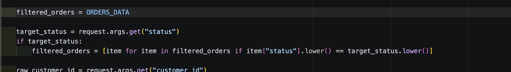
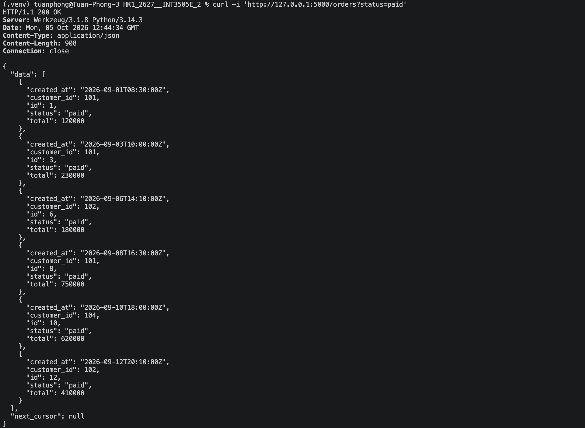
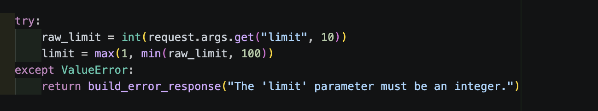
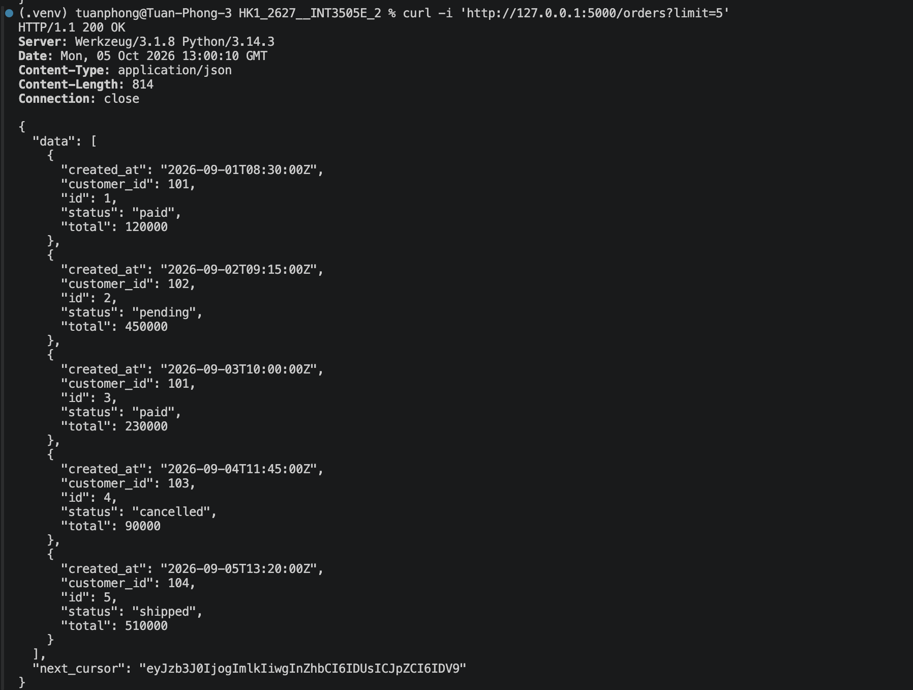
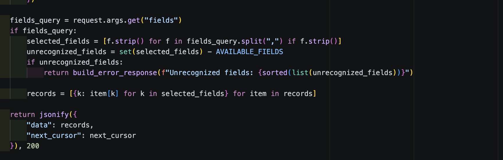
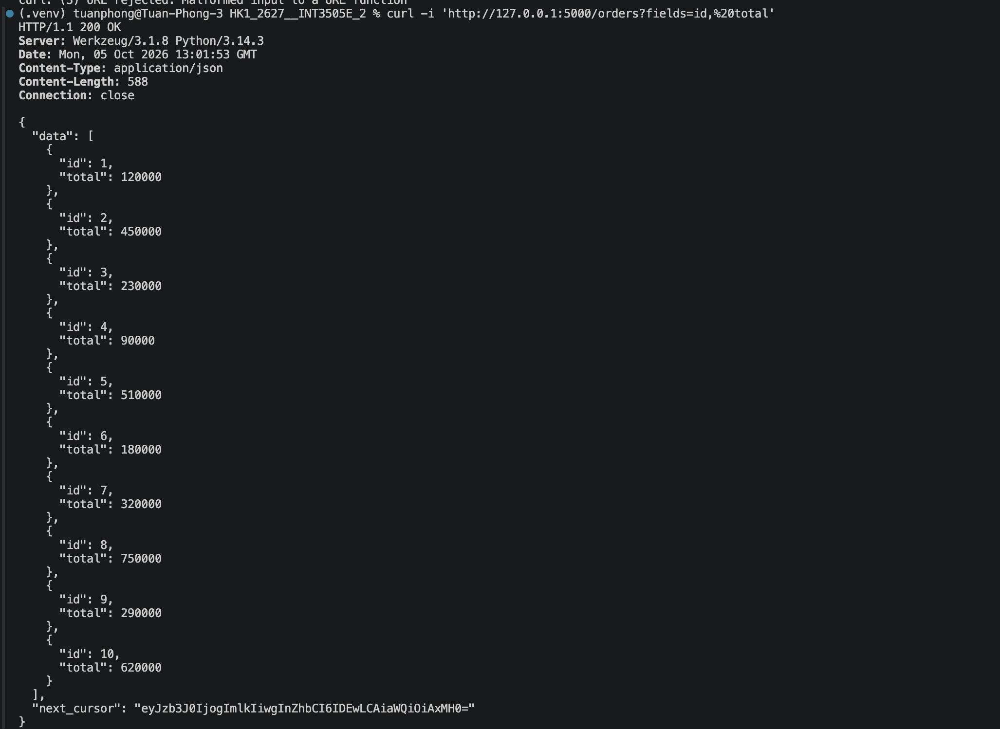
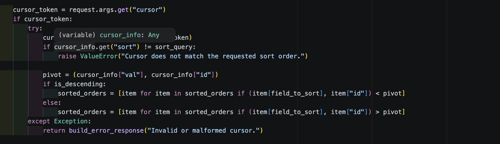
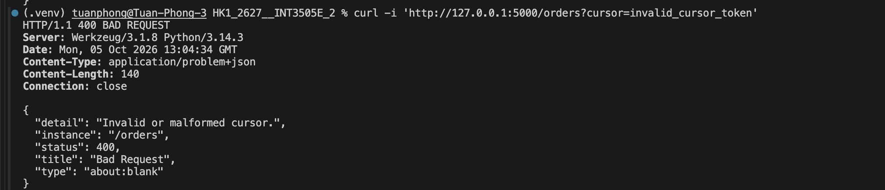

# Lab 1: Thiết kế resource cho Blog API

## 1. Xác định resources trong miền
Các tài nguyên chính của nền tảng blog đơn giản bao gồm: bài viết, bình luận, thẻ, và hồ sơ người dùng. Hệ thống cũng có chức năng đăng ký theo dõi.

## 2. Phân loại Collection / Item / Sub-resource
- Collection: /users, /posts, /tags, /follow
- Item: /users/<id>, /posts/<id>, /tags/{slugs}, /comments/<id>
- Sub-resources: /users/{id}/profile, /users/{id}/followers, /users/{id}/following

## 3. Sơ đồ cây endpoint và version segment
- Users:
  - GET /api/v1/users: Danh sách người dùng
  - GET /api/v1/users/{id}: Chi tiết hồ sơ một người dùng
  - GET /api/v1/users/{id}/followers: Danh sách người theo dõi
  - POST /api/v1/users/{id}/followers: Thực hiện hành động theo dõi
- Posts, comments
  - GET /api/v1/posts: Danh sách bài viết
  - POST /api/v1/posts: Tạo bài viết mới
  - GET /api/v1/posts/{id}: Chi tiết bài viết
  - PUT /api/v1/posts/{id}: Cập nhật bài viết
  - DELETE /api/v1/posts/{id}: Xóa bài viết
  - GET /api/v1/posts/{id}/comments: Danh sách bình luận của bài viết đó
  - POST /api/v1/posts/{id}/comments: Thêm bình luận vào bài viết
- Tags:
  - GET /api/v1/tags: Danh sách toàn bộ các thẻ

# Lab 2: Error handler trả về problem + json

## 1. Kiểm tra truy vấn thành công hay không

Kết quả: Trả về mã status 200 OK, dữ liệu JSON của người dùng {"id": 42, "name": "Alice"}.

## 2. Kiểm tra ngoại lệ nghiệp vụ

Kết quả: Trả về mã lỗi 404 NOT FOUND, header Content-Type: application/problem+json, phần body chứa đầy đủ các trường chuẩn theo RFC 7807: type, title, detail, status, instance, trace_id và trường mở rộng resource_id

## 3. Kiểm tra fallback lỗi định tuyến HTTP

Kết quả: Werkzeug HTTPException được chuyển đổi tự động thành cấu trúc problem+json với status 404, type là URL trỏ tới http-404

## 4. Kiểm tra bắt ngoại lệ chưa xử lý

Kết quả: Trả về mã 500 INTERNAL SERVER ERROR với thông điệp trung tính, ẩn toàn bộ stack trace kỹ thuật của hệ thống phía máy chủ

# Lab 3: Triển khai /orders có Cursor Pagination

## 1. Kiểm tra lọc theo trạng thái status=paid

Kết quả: Trả về mã status 200 OK, danh sách chỉ gồm các đơn hàng có trường status mang giá trị paid.

## 2. Kiểm tra giới hạn số lượng và sinh Cursor limit=5

Kết quả: Trả về mã 200 OK, giới hạn lấy đúng 5 bản ghi đầu tiên kèm chuỗi next_cursor được mã hóa Base64 opaque để truy vấn trang tiếp theo.

## 3. Kiểm tra trích xuất trường dữ liệu cụ thể fields=id, total

Kết quả: Trả về mã 200 OK, mỗi bản ghi trong mảng data chỉ chứa duy nhất hai thuộc tính id và total, giúp tối ưu lưu lượng truyền tải qua mạng.

## 4. Kiểm tra xử lý cursor hỏng / không hợp lệ

Kết quả: Bắt lỗi giải mã con trỏ và trả về mã lỗi 400 BAD REQUEST, Content-Type là application/problem+json với thông báo giải thích chi tiết trong trường detail.
