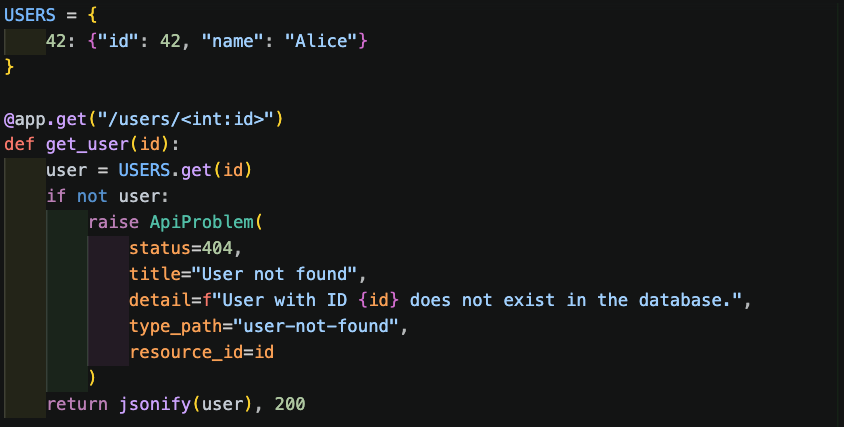
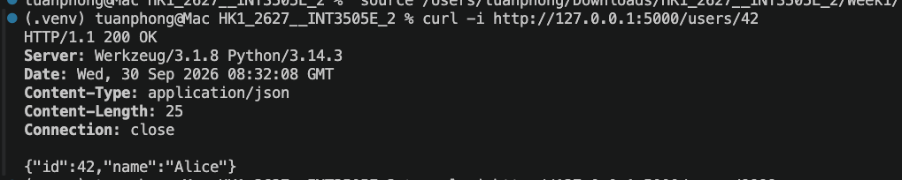
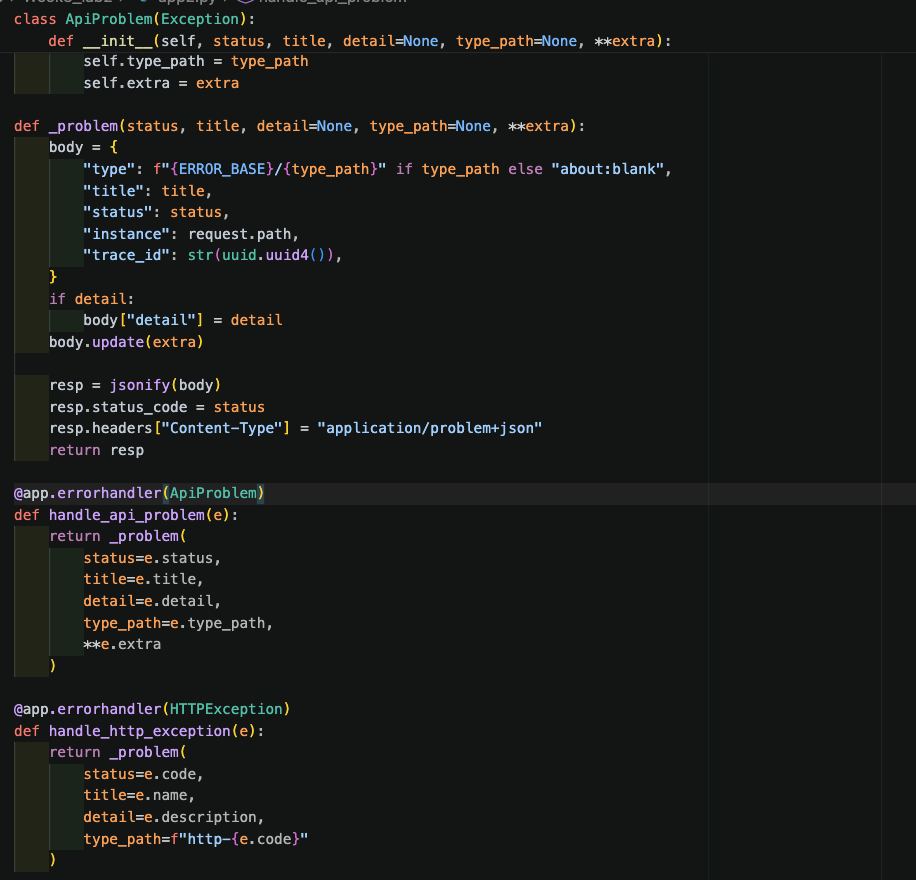
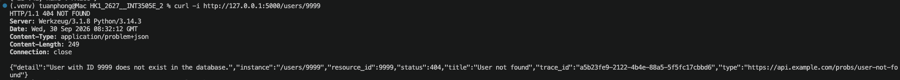
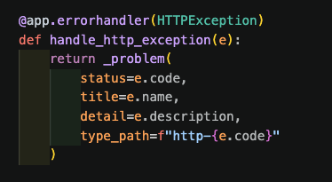
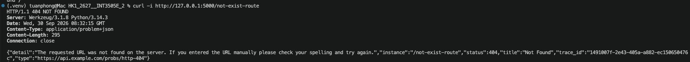
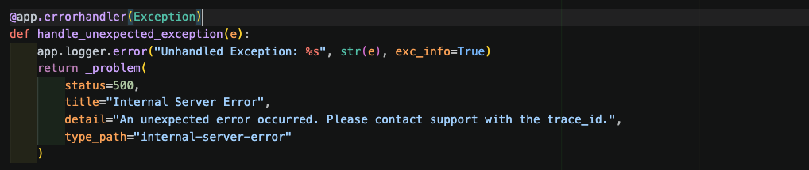
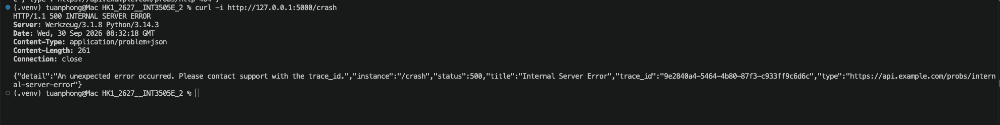

## 1. Kiểm tra truy vấn thành công hay không

Kết quả: Trả về mã status 200 OK, dữ liệu JSON của người dùng {"id": 42, "name": "Alice"}.

## 2. Kiểm tra ngoại lệ nghiệp vụ

Kết quả: Trả về mã lỗi 404 NOT FOUND, header Content-Type: application/problem+json, phần body chứa đầy đủ các trường chuẩn theo RFC 7807: type, title, detail, status, instance, trace_id và trường mở rộng resource_id

## 3. Kiểm tra fallback lỗi định tuyến HTTP

Kết quả: Werkzeug HTTPException được chuyển đổi tự động thành cấu trúc problem+json với status 404, type là URL trỏ tới http-404

## 4. Kiểm tra bắt ngoại lệ chưa xử lý

Kết quả: Trả về mã 500 INTERNAL SERVER ERROR với thông điệp trung tính, ẩn toàn bộ stack trace kỹ thuật của hệ thống phía máy chủ
